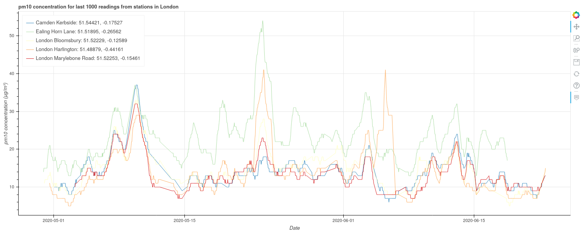

# openaq-lambda
Proxy openaq's API with AWS lambda to produce charts

Simple example: [here](https://wj3t97djc9.execute-api.eu-central-1.amazonaws.com/?city=Dublin)



To build the zip package for deploying on lambda:

1. ```pip install --target ./package -r requirements.txt```
2. ```cd package; zip -r9 ../openaq_lambda.zip .```
3. Upload the package to S3 - link the lambda function to the package